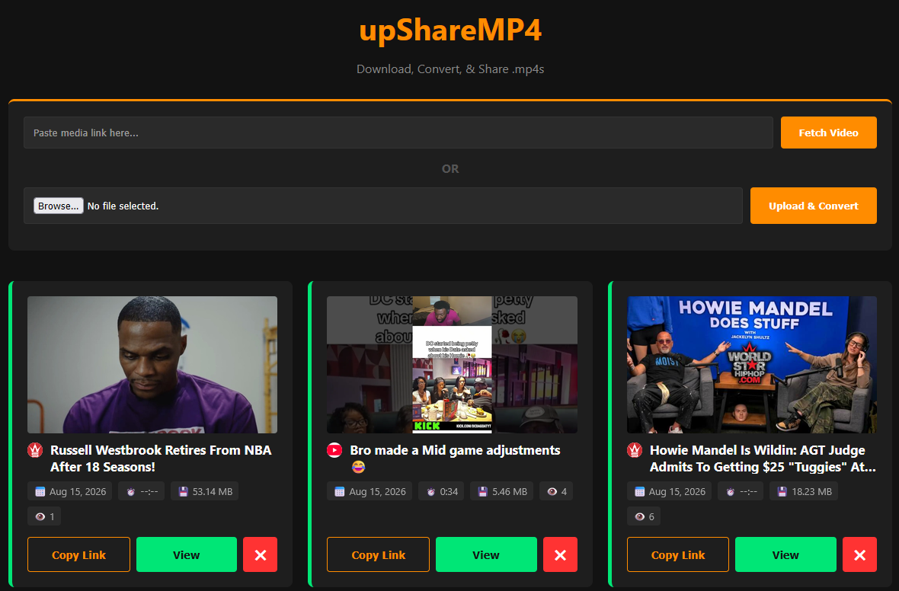

# upShareMP4

  

## Features
- **Instant Video Fetching:** Powered by `yt-dlp` to pull media & auto-merge into clean `.mp4` formats.
- **Local File Conversion:** Upload any local video & auto-convert via FFmpeg.
- **Stat Tracking:** Real-time view counts, bandwidth monitoring, & disk space tracking.
- **Mobile-Friendly UI:** Designed for seamless mobile use w/ dual-session authentication.
- **Multi User Support:** Easily create & manage additional users from the admin dashboard.

## Environment Variables
| Variable | Description | Default |
| :--- | :--- | :--- |
| `APP_USERNAME` | Username for logging into the web console | `admin` |
| `APP_PASSWORD` | Password for logging into the web console | `adminpassword` |
| `PORT` | Internal port the application listens on | `29738` |
| `DOWNLOAD_DIR` | Internal container path for video storage | `/downloads` |
| `CONFIG_DIR` | Internal container path for persistent database storage | `/config` |
| `SESSION_DAYS` | Number of days before browser session expires | `30` |
| `MAX_DOWNLOAD_MB` | File size limit before prompting for password override | `150` |
| `YTDLP_COOKIES` | Raw Netscape cookie string for authenticating restricted sites | `""` |
